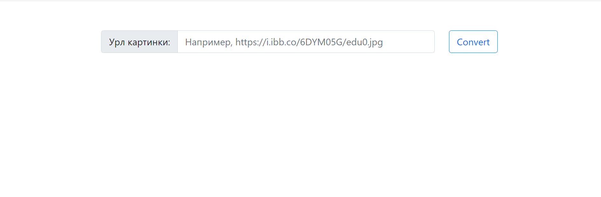

# Конвертер в символьную графику

* При запуске приложения по http://localhost:8888/ можно конвретировать изображение по url
в символьную графику .

* Максимальные размеры конвертированной картинки: 300 на 300
* Изначальная картинка скалируется пропорционально